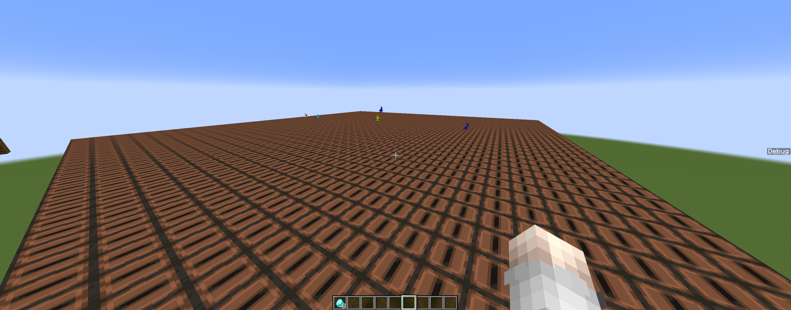

# LA-CTF-McFlagChecker

**rev/McFlagChecker** – a reverse engineering challenge from LC CTF. In this challenge, you are provided with a Minecraft datapack that implements an obfuscated flag-checking routine. Your goal is to reverse the datapack’s transformations in order to recover the correct flag input.

---

## Overview

The datapack performs a series of nontrivial mathematical and bitwise operations on a 40-element register array. During its forward pass, the datapack applies multiple transformations, including arithmetic operations, bitwise XOR operations, modular exponentiation, and finally a modular matrix multiplication. The final output is then compared against a target set of registers. Your challenge is to reverse these operations to determine the original input that produces the given output.

---

## Challenge Details

### Datapack Workflow

1. **Input Registers:**  
   The challenge begins with an array of 40 numbers that encode the flag (typically represented as ASCII values). These numbers, when interpreted as characters, form the flag string (for example, something that might start with "lactf{...}") and by default it is [0] *40.

2. **Forward Transformations:**  
   The datapack applies several layers of transformations:
   
   - **Linear Congruential Transformation:**  
     A variable is repeatedly transformed by multiplying by 97, adding 129, and then taking the result modulo 256. This process is used to generate dynamic values for subsequent operations.
   
   - **Bitwise XOR Operation:**  
     Each register value is combined with a dynamically generated value using a bitwise XOR. This operation is performed bit-by-bit, ensuring that the transformation is nontrivial to reverse.
   
   - **Modular Exponentiation:**  
     After the XOR, each value is transformed by raising a fixed base (6) to the power of the current value, with the result taken modulo 251. This step further obscures the relationship between the input and the output.
   
   - **Modular Matrix Multiplication:**  
     Finally, the datapack mixes the register values by multiplying them with a 40×40 matrix (3D array but we can drop y value since it all Zeros) that can be found in reset.mcfunction:
```
data merge block 0 0 0 {RecordItem:{id:"minecraft:stone",Count:1b,tag:{Storage: 22}}}
data merge block 0 0 1 {RecordItem:{id:"minecraft:stone",Count:1b,tag:{Storage: 31}}}
data merge block 0 0 2 {RecordItem:{id:"minecraft:stone",Count:1b,tag:{Storage: 224}}}
data merge block 0 0 3 {RecordItem:{id:"minecraft:stone",Count:1b,tag:{Storage: 191}}}
data merge block 0 0 4 {RecordItem:{id:"minecraft:stone",Count:1b,tag:{Storage: 160}}}
data merge block 0 0 5 {RecordItem:{id:"minecraft:stone",Count:1b,tag:{Storage: 143}}}
data merge block 0 0 6 {RecordItem:{id:"minecraft:stone",Count:1b,tag:{Storage: 101}}}
data merge block 0 0 7 {RecordItem:{id:"minecraft:stone",Count:1b,tag:{Storage: 173}}}
data merge block 0 0 8 {RecordItem:{id:"minecraft:stone",Count:1b,tag:{Storage: 255}}}
data merge block 0 0 9 {RecordItem:{id:"minecraft:stone",Count:1b,tag:{Storage: 239}}}
data merge block 0 0 10 {RecordItem:{id:"minecraft:stone",Count:1b,tag:{Storage: 140}}}
data merge block 0 0 11 {RecordItem:{id:"minecraft:stone",Count:1b,tag:{Storage: 63}}}
data merge block 0 0 12 {RecordItem:{id:"minecraft:stone",Count:1b,tag:{Storage: 139}}}
data merge block 0 0 13 {RecordItem:{id:"minecraft:stone",Count:1b,tag:{Storage: 17}}}
data merge block 0 0 14 {RecordItem:{id:"minecraft:stone",Count:1b,tag:{Storage: 22}}}
data merge block 0 0 15 {RecordItem:{id:"minecraft:stone",Count:1b,tag:{Storage: 206}}}
etc..
```
The following is the transformation matrix used in the challenge. Click to expand.

<details>
  <summary>View Block Data</summary>

  <pre>
[
  [22, 31, 224, 191, 160, 143, 101, 173, 255, 239, 140, 63, 139, 17, 22, 206, 120, 114, 221, 115, 198, 66, 13, 181, 161, 156, 111, 40, 10, 5, 7, 188, 155, 120, 253, 103, 51, 94, 72, 63],
  [37, 6, 237, 26, 169, 62, 173, 163, 99, 89, 130, 44, 151, 121, 55, 191, 221, 253, 205, 232, 79, 186, 1, 137, 1, 104, 228, 231, 200, 177, 35, 37, 206, 30, 132, 46, 63, 115, 66, 147],
  [39, 251, 58, 168, 15, 4, 190, 16, 105, 190, 29, 36, 121, 190, 49, 66, 42, 107, 160, 193, 54, 156, 169, 65, 37, 198, 9, 80, 160, 159, 73, 54, 81, 157, 220, 162, 158, 126, 83, 130],
  [251, 87, 166, 230, 213, 64, 201, 92, 220, 87, 152, 221, 229, 99, 212, 154, 137, 152, 138, 138, 56, 79, 135, 94, 189, 97, 129, 199, 208, 16, 230, 35, 3, 74, 108, 92, 5, 236, 7, 141],
  [175, 62, 85, 95, 117, 160, 108, 93, 238, 113, 197, 191, 23, 92, 188, 125, 49, 100, 87, 48, 173, 247, 230, 240, 109, 34, 58, 148, 232, 154, 233, 34, 10, 105, 105, 181, 217, 136, 73, 89],
  [223, 180, 63, 11, 95, 171, 252, 145, 17, 171, 155, 213, 223, 206, 46, 178, 102, 70, 219, 45, 165, 48, 173, 215, 125, 235, 190, 12, 244, 41, 189, 19, 195, 63, 100, 13, 43, 238, 112, 25],
  [27, 44, 71, 106, 165, 208, 11, 101, 162, 15, 65, 254, 107, 153, 176, 45, 62, 87, 71, 84, 226, 167, 209, 94, 121, 168, 230, 104, 236, 212, 178, 192, 240, 115, 86, 65, 81, 163, 141, 58],
  [43, 234, 129, 248, 62, 194, 144, 145, 138, 86, 223, 115, 161, 166, 57, 161, 118, 168, 121, 85, 179, 68, 117, 207, 108, 34, 142, 3, 221, 170, 189, 29, 42, 68, 200, 205, 16, 221, 35, 223],
  [181, 54, 186, 172, 171, 141, 47, 134, 87, 22, 195, 180, 65, 64, 79, 24, 137, 250, 102, 208, 96, 144, 146, 140, 227, 128, 191, 87, 168, 167, 240, 85, 130, 104, 58, 25, 203, 252, 18, 85],
  [186, 150, 21, 105, 16, 170, 167, 222, 149, 139, 222, 205, 85, 220, 186, 207, 226, 102, 77, 187, 13, 253, 46, 244, 206, 66, 129, 205, 154, 66, 119, 8, 254, 2, 160, 74, 238, 197, 160, 125],
  [177, 2, 147, 99, 14, 200, 209, 58, 4, 86, 214, 28, 131, 136, 131, 195, 85, 93, 34, 40, 183, 96, 144, 101, 55, 15, 25, 26, 166, 10, 200, 53, 21, 71, 192, 206, 200, 21, 17, 66],
  [1, 246, 244, 136, 107, 231, 215, 7, 231, 53, 220, 10, 233, 127, 61, 8, 223, 84, 170, 129, 6, 208, 152, 236, 54, 155, 161, 85, 25, 15, 207, 107, 239, 208, 126, 56, 30, 83, 34, 23],
  [79, 204, 45, 215, 29, 240, 167, 63, 67, 230, 20, 132, 44, 4, 189, 135, 126, 63, 255, 162, 130, 244, 158, 222, 158, 12, 53, 48, 113, 205, 9, 233, 91, 91, 195, 38, 58, 246, 210, 187],
  [38, 164, 215, 80, 117, 92, 187, 131, 100, 217, 8, 160, 126, 189, 4, 46, 113, 51, 111, 205, 201, 50, 89, 37, 28, 92, 38, 40, 131, 111, 55, 113, 221, 51, 125, 214, 28, 97, 104, 7],
  [16, 208, 78, 189, 123, 145, 51, 128, 119, 28, 23, 220, 123, 218, 186, 244, 196, 112, 89, 172, 212, 221, 188, 10, 175, 16, 185, 21, 228, 7, 136, 246, 130, 124, 180, 168, 233, 198, 204, 150],
  [237, 10, 109, 189, 163, 105, 179, 123, 17, 58, 230, 14, 205, 76, 86, 10, 113, 25, 205, 56, 237, 134, 167, 118, 227, 153, 156, 173, 237, 13, 145, 104, 121, 59, 95, 57, 133, 29, 21, 246],
  [154, 207, 232, 255, 84, 106, 243, 65, 224, 69, 229, 17, 47, 30, 16, 31, 197, 139, 211, 3, 73, 79, 24, 201, 212, 172, 239, 183, 242, 231, 72, 113, 163, 187, 71, 250, 102, 161, 31, 152],
  [95, 24, 249, 71, 129, 15, 170, 89, 252, 207, 236, 32, 16, 32, 139, 207, 152, 81, 214, 167, 94, 85, 247, 138, 226, 50, 248, 124, 183, 70, 9, 3, 240, 190, 221, 59, 21, 94, 123, 17],
  [167, 183, 249, 72, 228, 96, 45, 58, 63, 188, 80, 72, 176, 52, 156, 148, 72, 185, 171, 121, 38, 238, 40, 190, 34, 31, 191, 9, 246, 46, 88, 155, 128, 36, 87, 73, 158, 172, 38, 244],
  [16, 218, 10, 36, 147, 253, 206, 2, 2, 253, 199, 123, 29, 208, 180, 76, 254, 186, 150, 119, 20, 1, 186, 45, 45, 44, 209, 175, 12, 169, 182, 109, 153, 58, 229, 15, 189, 13, 100, 49],
  [132, 219, 69, 29, 19, 49, 46, 140, 189, 10, 130, 35, 77, 167, 68, 106, 193, 5, 31, 16, 134, 181, 14, 118, 106, 70, 15, 44, 1, 28, 223, 121, 63, 121, 121, 113, 179, 133, 203, 74],
  [87, 53, 122, 225, 219, 30, 96, 110, 219, 187, 179, 19, 85, 97, 80, 195, 138, 183, 31, 249, 1, 57, 112, 72, 176, 51, 137, 223, 160, 45, 132, 233, 205, 242, 84, 41, 15, 37, 125, 180],
  [10, 60, 250, 242, 88, 252, 147, 71, 215, 131, 70, 104, 75, 134, 35, 107, 19, 116, 150, 133, 144, 201, 56, 249, 27, 254, 1, 87, 155, 135, 67, 25, 144, 180, 68, 226, 167, 137, 93, 49],
  [25, 5, 165, 16, 199, 92, 100, 52, 42, 63, 49, 118, 75, 67, 232, 216, 218, 177, 199, 205, 194, 187, 132, 226, 151, 126, 22, 23, 205, 157, 31, 180, 70, 38, 51, 54, 178, 38, 130, 220],
  [179, 243, 147, 70, 25, 124, 81, 255, 114, 153, 211, 94, 5, 248, 19, 186, 156, 225, 105, 169, 217, 47, 176, 47, 203, 190, 71, 71, 13, 133, 170, 139, 53, 113, 11, 248, 70, 0, 122, 79],
  [28, 248, 39, 0, 168, 193, 136, 51, 40, 29, 88, 51, 161, 152, 147, 113, 203, 204, 67, 118, 235, 192, 224, 90, 120, 251, 63, 58, 205, 163, 0, 26, 246, 108, 57, 43, 53, 79, 193, 107],
  [137, 169, 40, 18, 185, 159, 120, 192, 144, 206, 181, 44, 107, 115, 78, 132, 220, 199, 20, 141, 45, 252, 213, 189, 23, 229, 67, 31, 131, 214, 9, 45, 55, 148, 198, 184, 119, 16, 187, 215],
  [121, 93, 23, 246, 210, 234, 60, 143, 216, 121, 18, 70, 102, 180, 19, 7, 139, 199, 68, 144, 88, 22, 42, 56, 241, 233, 224, 122, 173, 197, 104, 107, 202, 34, 14, 193, 40, 123, 51, 173],
  [10, 240, 51, 83, 156, 41, 97, 207, 11, 255, 160, 124, 135, 108, 125, 213, 137, 159, 188, 203, 16, 208, 115, 53, 118, 142, 253, 171, 65, 170, 251, 154, 12, 191, 62, 204, 3, 246, 62, 21],
  [168, 182, 29, 169, 32, 132, 161, 175, 142, 190, 237, 43, 215, 81, 204, 151, 251, 37, 73, 242, 18, 71, 43, 140, 28, 41, 236, 229, 232, 132, 79, 175, 34, 132, 121, 22, 49, 223, 184, 220],
  [186, 230, 180, 255, 213, 179, 254, 40, 46, 123, 46, 250, 246, 226, 115, 198, 217, 248, 126, 79, 208, 192, 166, 71, 16, 124, 180, 214, 67, 202, 1, 252, 8, 86, 247, 234, 35, 8, 113, 235],
  [146, 205, 202, 240, 86, 84, 227, 74, 241, 208, 76, 251, 223, 85, 38, 56, 99, 163, 209, 215, 123, 158, 183, 230, 123, 245, 43, 216, 79, 237, 33, 90, 80, 19, 223, 13, 75, 134, 90, 101],
  [218, 15, 55, 79, 147, 13, 33, 170, 42, 187, 198, 99, 84, 191, 85, 68, 26, 98, 196, 126, 68, 169, 48, 225, 75, 91, 218, 27, 204, 15, 78, 93, 196, 17, 50, 193, 146, 145, 243, 14],
  [105, 107, 115, 139, 62, 65, 119, 43, 91, 142, 222, 133, 19, 113, 77, 253, 96, 40, 253, 125, 48, 138, 157, 128, 144, 225, 178, 12, 104, 231, 129, 59, 134, 102, 224, 216, 185, 110, 104, 77],
  [70, 200, 5, 118, 184, 188, 114, 228, 218, 13, 134, 199, 225, 74, 171, 209, 35, 8, 116, 86, 65, 160, 184, 173, 130, 13, 70, 126, 141, 153, 110, 78, 68, 51, 104, 37, 12, 187, 97, 206],
  [7, 213, 143, 135, 45, 82, 60, 97, 195, 38, 54, 23, 166, 50, 24, 170, 86, 40, 227, 239, 58, 242, 160, 32, 36, 182, 103, 51, 222, 115, 166, 94, 144, 70, 145, 126, 143, 30, 122, 51],
  [224, 100, 172, 240, 58, 75, 14, 225, 85, 77, 146, 92, 99, 105, 208, 244, 254, 16, 162, 155, 140, 149, 28, 115, 219, 84, 172, 159, 207, 152, 235, 76, 95, 90, 199, 208, 28, 160, 216, 170],
  [166, 6, 251, 49, 91, 42, 101, 204, 51, 14, 148, 9, 17, 90, 192, 250, 157, 27, 152, 49, 90, 31, 218, 10, 192, 11, 87, 7, 195, 112, 10, 216, 3, 252, 29, 194, 214, 169, 71, 37],
  [137, 132, 120, 218, 251, 123, 210, 249, 196, 63, 191, 33, 185, 148, 6, 101, 201, 10, 176, 139, 129, 111, 32, 152, 38, 230, 82, 81, 37, 230, 192, 161, 216, 106, 201, 167, 115, 5, 51, 164],
  [130, 8, 19, 5, 183, 252, 84, 85, 201, 129, 11, 135, 167, 10, 180, 184, 117, 75, 181, 152, 194, 16, 197, 169, 182, 167, 248, 71, 180, 62, 190, 140, 246, 252, 209, 129, 146, 30, 96, 159],
]

  </pre>
</details>

  referred to as the block data that spawn in the game in same index location:

 This final transformation diffuses the information across all 40 registers.

3. **Output Comparison:**  
   The resulting registers are compared against a predetermined target array that can be found at the end of check_flag.mcfunction:
```
execute unless score Global Reg0 matches 137 run scoreboard players set Global var4 0
execute unless score Global Reg1 matches 193 run scoreboard players set Global var4 0
execute unless score Global Reg2 matches 59 run scoreboard players set Global var4 0
execute unless score Global Reg3 matches 168 run scoreboard players set Global var4 0
execute unless score Global Reg4 matches 164 run scoreboard players set Global var4 0
execute unless score Global Reg5 matches 129 run scoreboard players set Global var4 0
etc..
```
```
[165, 159, 193, 12, 170, 90, 182, 156, 214, 172, 62, 59, 106, 175, 186, 174, 231, 160, 56, 67, 221, 44, 68, 90, 244, 192, 123, 140, 245, 218, 169, 58, 8]
```
   To solve the challenge, you must reverse these operations to determine the original input that yields the target output.

---

## Provided Code Explanation

The challenge comes with two conceptual components: the backward pass (the reversal process) and the forward pass (the original datapack logic). Below is an explanation of these components without including any actual code.

### 1. Forward Pass (Original Datapack Functions but in py)

The forward pass comprises several functions that carry out the following operations:

- **Value Transformation (Linear Congruential Generator):**  
  A function multiplies an input value by 97, adds 129, and takes the result modulo 256. This produces a dynamically changing value that is used in subsequent operations.

- **Bitwise XOR Operation:**  
  The datapack uses a dedicated routine to compute the bitwise XOR of two numbers on a bit-by-bit basis. This routine essentially iterates through each bit of the two input numbers and reconstructs the result of the XOR.

- **Modular Exponentiation:**  
  Another function computes the modular exponentiation of 6 raised to the power of a given value, with the result taken modulo 251. This operation significantly alters the distribution of values in the register array.

- **Modular Matrix Multiplication:**  
  Finally, a matrix multiplication is performed where the 40-element register array is multiplied by a 40×40 matrix (the block data), with all operations performed modulo 251. This step mixes all the register values together.

The forward pass processes the original register array (which encodes the flag) through these steps, ultimately producing a set of registers that are compared to a target. Your task is to reverse these steps to recover the original flag.

### 2. Backward Pass (Reversal Process)

The backward pass involves undoing each step of the forward transformations:

- **Matrix Inversion:**  
  The final step of the forward pass is a modular matrix multiplication using a 40×40 matrix. To reverse this, the matrix is inverted modulo 251. Multiplying the target output by this inverted matrix recovers an intermediate vector.

- **Reversing Modular Exponentiation:**  
  Since the forward pass applied modular exponentiation with base 6 (i.e., computing 6 raised to some power modulo 251), the reversal requires solving the discrete logarithm problem. In other words, for each element of the intermediate vector, you must determine the exponent that produces that element when 6 is raised to it modulo 251.

- **XOR Mask Reversal:**  
  Prior to the exponentiation, the forward pass applied a bitwise XOR between each register value and a mask. This mask is generated through a linear congruential process (multiplying by 97, adding 129, modulo 256). By regenerating this mask, you can XOR the recovered values to obtain the original register values.

The end result of the backward pass is the recovery of the original 40-element register array, which can be converted into the flag string.

---

## How to Approach the Challenge

1. **Analyze the Datapack:**  
   Begin by converting the Minecraft datapack’s `.mcfunction` files (Minecraft assembly) like this:
```
scoreboard players operation Global y = Global Param1
scoreboard players operation Global x = Global Param0
scoreboard players set Global f3_scratch0 1
execute if score Global x > Global y run function chall:line019/execute2
execute if score Global f3_scratch0 matches 1.. run scoreboard players operation Global ReturnValue = Global y
```
 into a more readable format (for example, by rewriting them in a high-level language). This will help you understand the sequence and nature of the transformations.

2. **Reconstruct the Forward Pass:**  
   Carefully simulate the forward pass by following each transformation step. Understanding how the original flag is processed is crucial for devising a reversal strategy.

3. **Implement the Backward Pass:**  
   Reverse each transformation in the exact opposite order of the forward pass:
   - Start by undoing the matrix multiplication using modular matrix inversion.
   - Next, reverse the modular exponentiation by solving the discrete logarithm problem.
   - Finally, regenerate and apply the XOR mask to recover the original register values.

4. **Recover the Flag:**  
   Once you have the original register array, convert the ASCII values into characters to reveal the flag.

---

# Final Answer

After successfully reversing the transformations applied by the Minecraft datapack, we recover the original register values:

**Recovered input registers (Decimal values):**
```
[108, 97, 99, 116, 102, 123, 121, 52, 89, 95, 116, 104, 49, 115, 95, 102, 108, 52, 103, 95, 103, 49, 118, 51, 115, 95, 121, 48, 117, 95, 52, 95, 100, 49, 52, 109, 48, 110, 100, 125]
```

**Converting the Decimal values to ASCII characters:**
```
lactf{y4Y_th1s_fl4g_g1v3s_y0u_4_d14m0nd}
```
This confirms that our backward pass correctly reconstructed the original flag used as input to the datapack.

---

# Useful Commands for the Challenge

During the challenge, you can use the following Minecraft commands to interact with the datapack and test different inputs:

### **Core Commands**
- **Check the flag:**  
  Use `/function chall:check_flag` to run the flag-checking function in the datapack.

- **Reset the challenge state:**  
  Use `/function chall:reset` to reset the challenge, useful if something goes wrong.

- **Reload the datapack:**  
  Use `/reload` to reload the Minecraft world’s datapacks if you change the datapack code.

### **Custom Testing Commands**
- **Set a custom flag input for testing:**  
  Use `/function chall:setter` to manually test a custom flag input (change the regs values in setter.mcfunction).

### **Scoreboard Debugging Commands**
- **Retrieve the value of a specific register (e.g., reg0):**  
  Use `/scoreboard players get Global reg0` to print the current value stored in `reg0`.

- **Manually set a register value (e.g., reg0 to 100):**  
  Use `/scoreboard players set Global reg0 100` to set `reg0` to 100 for debugging purposes.

